<div align="center">


# Agent Czesiek

**Desktopowy asystent głosowy i tekstowy: rozmawia z Tobą, a pracę wykonuje w tle.**

[](apps/desktop) [](docs/product/RELEASE_PIPELINE.md) [](https://github.com/NousResearch/hermes-agent) [](#licencje-i-kontakt)

</div>

<p align="center">
  <a href="https://github.com/aievolutionpl/AGENT_CZESIEK/releases">Pobierz aplikację</a> ·
  <a href="#jak-to-działa">Jak to działa</a> ·
  <a href="#pierwsze-uruchomienie">Zacznij tutaj</a> ·
  <a href="#własne-skille">Dodaj własną umiejętność</a> ·
  <a href="#dla-deweloperów">Dla deweloperów</a>
</p>

> **Mówisz, co chcesz osiągnąć. Czesiek dopytuje, przyjmuje zlecenie, a Hermes wykonuje je narzędziami i wraca z raportem.**
> Projekt rozwija AI Evolution Polska, korzystając z silnika Hermes Agent od Nous Research.

## Spis treści

- [Czym jest Czesiek](#czym-jest-czesiek)
- [Jak to działa](#jak-to-działa)
- [Tak wygląda aplikacja](#tak-wygląda-aplikacja)
- [Pierwsze uruchomienie](#pierwsze-uruchomienie)
- [Workspace i nawigacja](#workspace-i-nawigacja)
- [Rozmowa głosowa i orb](#rozmowa-głosowa-i-orb)
- [Agenci, subagenci i tablica pracy](#agenci-subagenci-i-tablica-pracy)
- [Własne skille](#własne-skille)
- [Pamięć, mapa wiedzy i profile](#pamięć-mapa-wiedzy-i-profile)
- [Integracje i modele](#integracje-i-modele)
- [Bezpieczeństwo i prywatność](#bezpieczeństwo-i-prywatność)
- [Co można zautomatyzować](#co-można-zautomatyzować)
- [Diagnostyka, aktualizacje i kopie](#diagnostyka-aktualizacje-i-kopie)
- [Rozwiązywanie problemów](#rozwiązywanie-problemów)
- [Dla deweloperów](#dla-deweloperów)
- [Znane ograniczenia](#znane-ograniczenia)
- [Co nowego](#co-nowego)
- [Licencje i kontakt](#licencje-i-kontakt)

## Czym jest Czesiek

Czesiek to jedno miejsce do rozmowy głosowej lub tekstowej z agentem AI. Opisujesz cel zwykłym językiem; agent planuje kroki, korzysta z dostępnych narzędzi (pliki, terminal, przeglądarka, Twoje konta) i może przekazać część pracy współpracownikom. W aplikacji widzisz rozmowy, zadania, pliki z wynikami, pamięć i mapę wiedzy. Przy działaniach wymagających zgody aplikacja pyta.

Charakter jest celowy: **Czesiek to kumpel z biura, nie kamerdyner.** Mówi krótko (na głos 2–3 zdania, resztę pokazuje na ekranie), ma własne zdanie, raportuje wprost także złe wyniki i zwykle proponuje następny krok. Opis charakteru: [docs/product/CZESIEK_CHARACTER.md](docs/product/CZESIEK_CHARACTER.md).

| Potrzebujesz… | Jak pomaga Czesiek |
| --- | --- |
| Omówić pomysł | Rozmowa głosowa lub tekstowa, doprecyzowanie celu, plan kolejnych kroków. |
| Wykonać zadanie | Narzędzia do plików, terminala i przeglądarki oraz delegowanie pracy, zależnie od konfiguracji. |
| Zacząć dzień | Raport dnia: zadania, spotkania i poczta z Google (po połączeniu), newsy i bieżące sesje. |
| Wrócić do ustaleń | Historia rozmów, wspomnienia i mapa wiedzy oparta o notatki Markdown (vault Obsidiana). |
| Powtarzać sprawdzony proces | Własne skille, role asystentów i zadania cykliczne. |
| Mieć asystenta pod ręką | Pulpit z animowanym orbem oraz osobna, przesuwana kula na pulpicie systemu. |
| Zachować kontrolę | Widoczne działania narzędzi, zgody, poziomy zaufania i dziennik tego, co Czesiek zrobił. |

Żeby odpowiadać przez model w chmurze, potrzebny jest własny klucz API albo logowanie obsługiwanym kontem (np. ChatGPT). Integracje z zewnętrznymi usługami konfigurujesz osobno — samo zainstalowanie programu nie łączy kont ani nie daje dostępu do każdej usługi.

## Jak to działa

Aplikacja ma trzy warstwy o jasno rozdzielonych rolach:

| Warstwa | Kto | Co robi | Czego nie robi |
| --- | --- | --- | --- |
| **Rozmowa** | Czesiek: interfejs (Electron i React) + model głosu | Słucha, dopytuje, przyjmuje zlecenie, mówi krótko i nie milknie podczas pracy. | Sam nie wykonuje zadań na komputerze. |
| **Praca** | Hermes Agent: silnik i model zadaniowy | Planuje, używa narzędzi, pamięci i skilli, deleguje do subagentów, uruchamia zadania cykliczne. | Nie ma dostępu poza tym, co skonfigurujesz i zatwierdzisz. |
| **Kontrola** | Ty | Zgody, poziomy zaufania, klucze, zablokowane strony, wybór profilu. | — |

### Droga jednego zlecenia

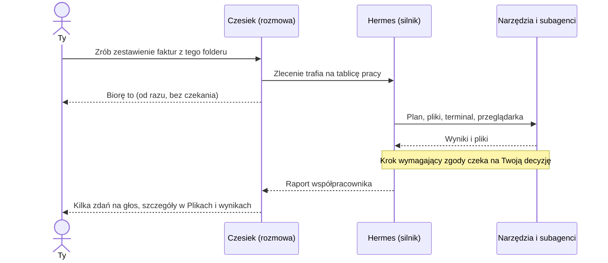

1. **Zlecenie.** Mówisz lub piszesz cel. W rozmowie głosowej model Live jest „agentem frontowym”: odpowiada od razu, a pracochłonne rzeczy przekazuje Hermesowi. Szybkie pytanie dostaje odpowiedź w tej samej rozmowie; dłuższa praca dostaje krótkie potwierdzenie i działa w tle, a wynik dochodzi później.
2. **Plan i wykonanie.** Hermes dobiera narzędzia i, jeśli trzeba, zleca fragmenty subagentom. Zlecenia z głosu trafiają na **tablicę pracy** (kanban), więc nie giną, gdy rozmowa toczy się dalej.
3. **Zgody.** Działania wymagające decyzji (np. wysłanie maila z Twojego konta) zatrzymują się i czekają na Ciebie. Orb pokazuje wtedy stan „Potrzebuje zgody”.
4. **Raport.** Wynik wraca jako krótkie streszczenie i pliki. Zadanie jest uznane za zrobione dopiero, gdy współpracownik zostawi raport; bez raportu widzisz je osobno jako zakończone bez raportu, a po 15 minutach ciszy jako zawieszone. Brak raportu nie jest potwierdzeniem sukcesu.

### Co jest czym

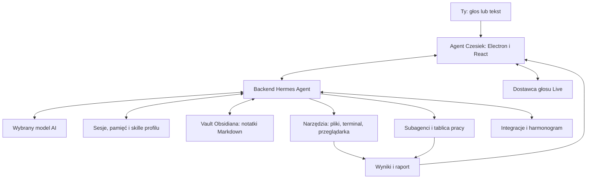

To uproszczony schemat odpowiedzialności. Interfejs rozmawia z backendem przez współdzieloną warstwę transportu (JSON-RPC). Przy połączeniu z backendem zdalnym narzędzia działają na jego hoście; okno na Twoim komputerze nie przenosi tam wykonywania zadań.

Dwa osobne wybory modeli: **model zadaniowy** (Hermes — myślenie i narzędzia) oraz **model głosu Live** (rozmowa). Możesz zmieniać je niezależnie, także z ekranu głosu. Domyślny tryb „Szybki” ogranicza wysiłek rozumowania, żeby rozmowa była żwawa.

## Tak wygląda aplikacja

Poniżej są rzeczywiste zrzuty aplikacji Electron z tej aktualizacji, wykonane na odizolowanym profilu testowym. Dane są demonstracyjne. Zrzuty nie zawierają prywatnych kluczy i nie potwierdzają połączenia z płatnymi usługami AI.

### Workspace: rozmowa i orb

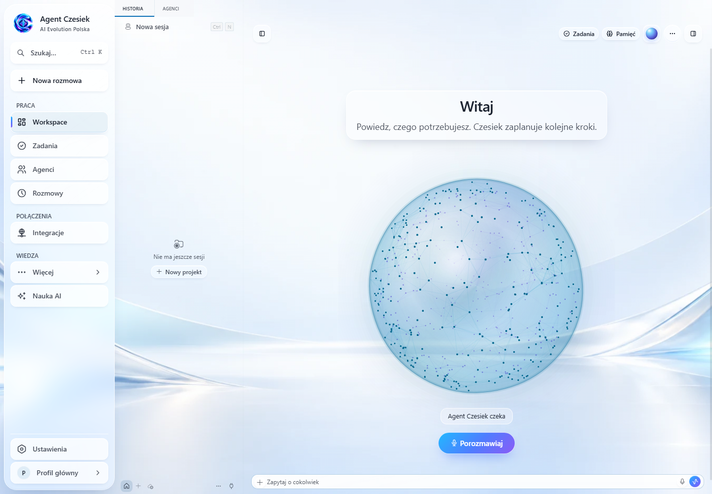

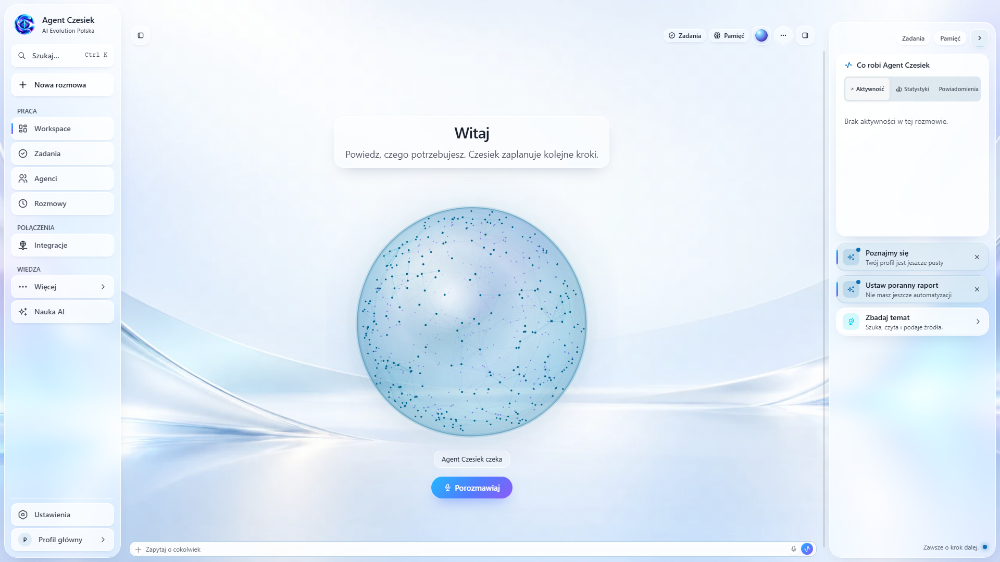

**Workspace** to główne miejsce rozmowy. Menu rozdziela pracę, połączenia i wiedzę; profil oraz ustawienia są na dole. Orb pokazuje stan rozmowy i pracy. Panele po bokach można chować, żeby zostawić więcej miejsca na rozmowę.

### Onboarding: od logo do własnego asystenta


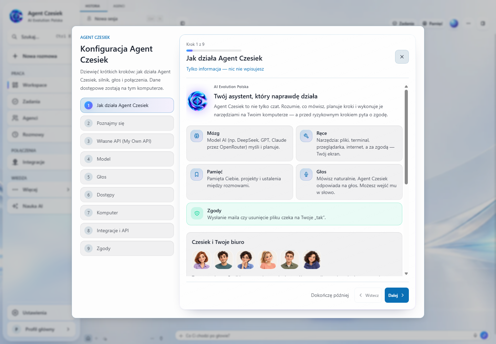

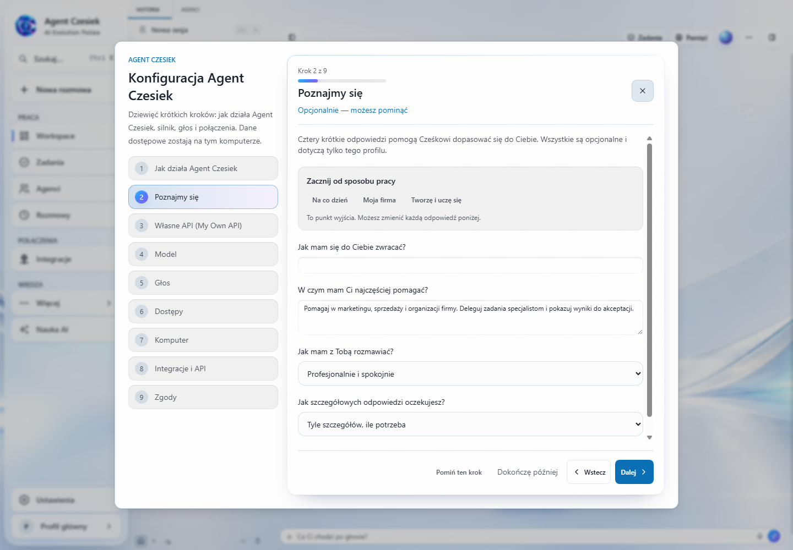

Przy każdym kroku widzisz, czy to **informacja**, **opcjonalny wybór**, czy **wymagane działanie**. W „Poznajmy się” możesz zacząć od „Na co dzień”, „Moja firma” lub „Tworzę i uczę się”. Potem dopasujesz imię, priorytety, ton oraz długość odpowiedzi. Te preferencje zostają w wybranym profilu.

### Biuro agentów

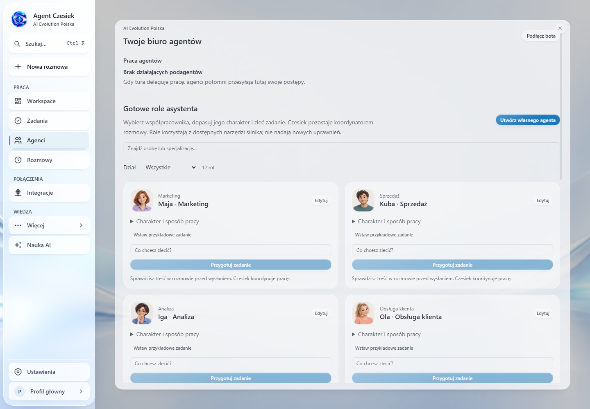

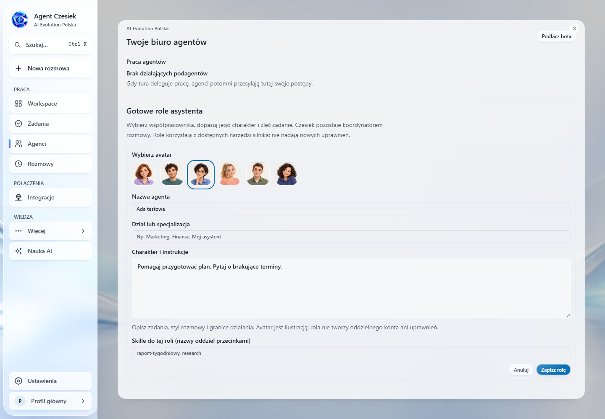

Wybierz dział, znajdź specjalistę i wstaw przykładowe zadanie albo własne polecenie. Przycisk **Przygotuj zadanie** przenosi jego treść do nowej rozmowy, gdzie możesz ją sprawdzić przed wysłaniem. **Utwórz własnego agenta** pozwala zapisać nazwę, dział, avatar, instrukcje oraz skille. Ilustracje mają lekką animację przy interakcji, wyłączaną przez preferencję ograniczenia ruchu.

### Ustawienia: co i gdzie podłączyć

| Ekran | Co ustawiasz |
| --- | --- |
| **Model** | Model pracy: analiza, narzędzia i zadania subagentów. |
| **Dostawcy** | Logowanie obsługiwanym kontem lub własny klucz API, np. OpenRouter. |
| **Głos** | Głosy Gemini, osobna zakładka ElevenLabs i ustawienia rozmowy Live. |
| **Wygląd** | Profil współpracy, język, motyw, skala i opcje przejrzystości. |
| **Czy wszystko działa?** | Diagnostyka modelu, głosu, mikrofonu i narzędzi. |
| **Integracje** | Połączenia z usługami oraz ich zakresy dostępu. |

<details>
<summary><strong>Profil i wygląd — imię, cele i sposób rozmowy</strong></summary>

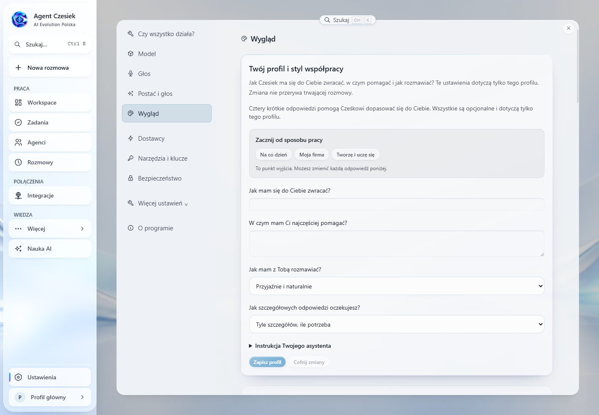

W **Ustawienia → Wygląd** zapisz swój profil współpracy. Zmiany instrukcji stosują się od nowej rozmowy, aby nie przebudowywać kontekstu trwającej sesji. Motyw, skalę i przejrzystość zmienisz dalej na tym ekranie.

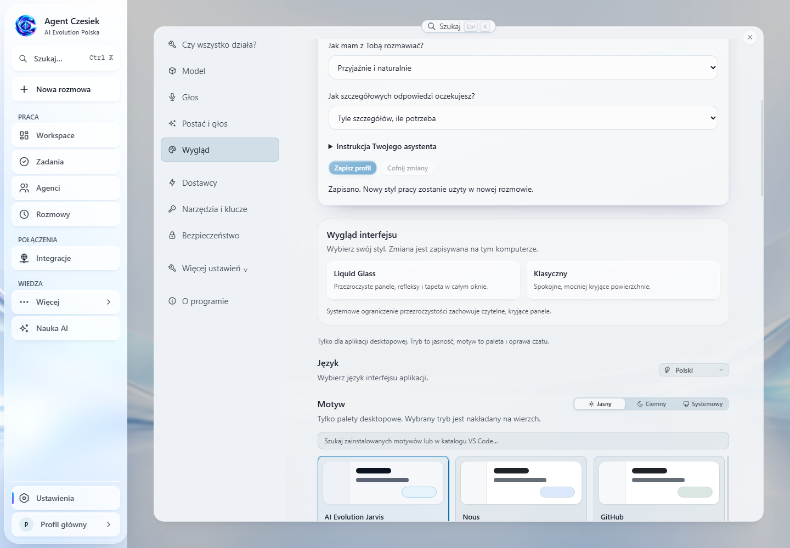

**Liquid Glass** jest domyślnym stylem: jedna tapeta obejmuje całe okno, a boczne menu i przyciski mają półprzezroczyste powierzchnie, rozmycie oraz delikatne refleksy. W sekcji **Wygląd interfejsu** wybierzesz też **Klasyczny**. Wybór zapisuje się na tym komputerze i pozostaje po ponownym uruchomieniu. Systemowe ograniczenie przezroczystości wyłącza rozmycie i zapewnia kryjące, czytelne panele.

</details>

<details>
<summary><strong>Dostawcy — model do pracy i Twoje konto API</strong></summary>

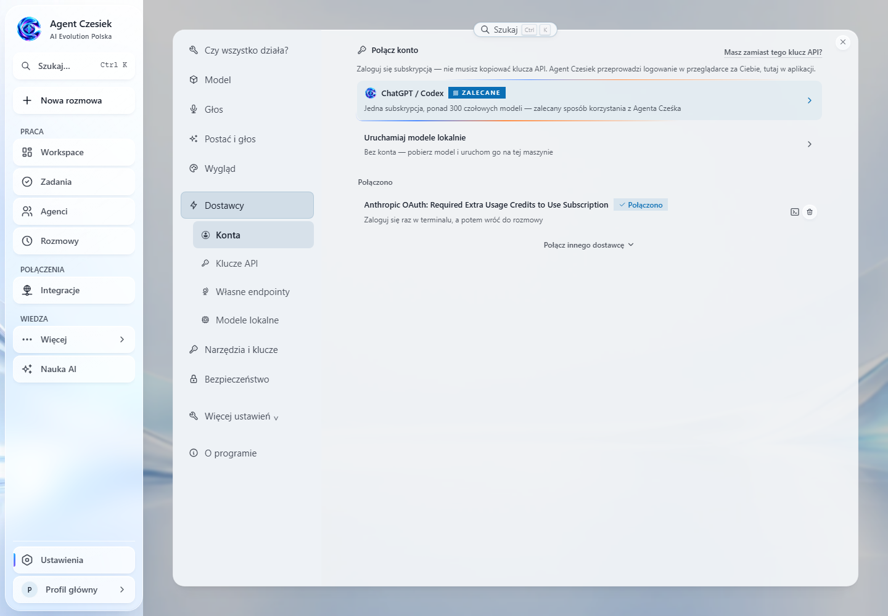

Najpierw połącz dostawcę w **Ustawienia → Dostawcy**, potem wybierz model w **Model**. OpenRouter to wygodna opcja do zadań; obsługiwane logowanie ChatGPT jest alternatywą. Dostępne modele, limity i rozliczenia zależą od Twojego konta. Klucz zapisuj wyłącznie w formularzu aplikacji.

</details>

<details>
<summary><strong>Głos — Gemini Live, wybór głosu i ElevenLabs</strong></summary>

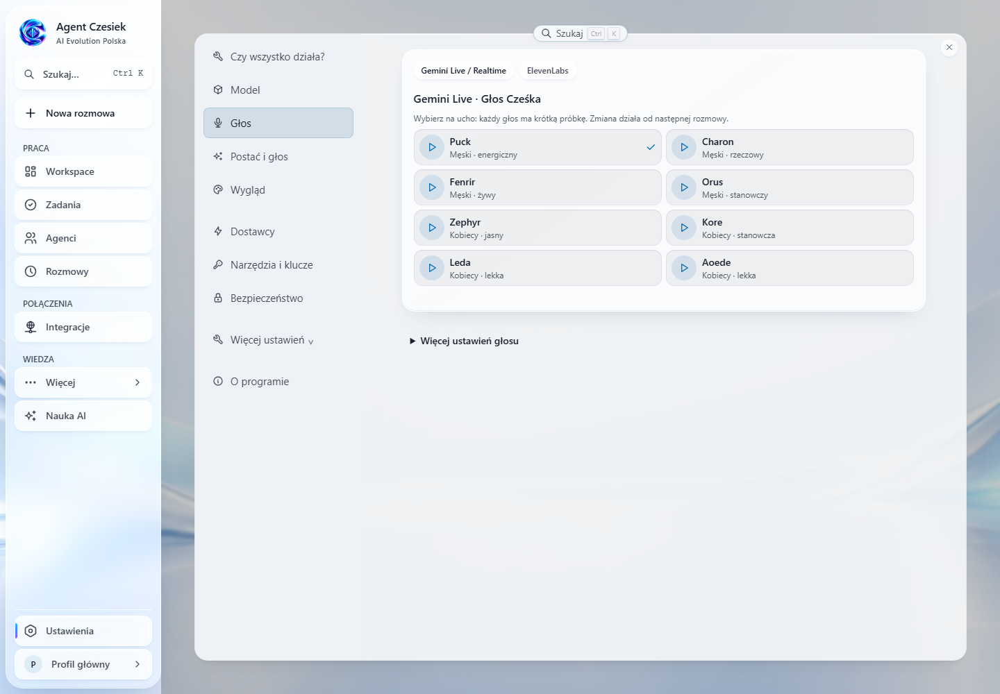

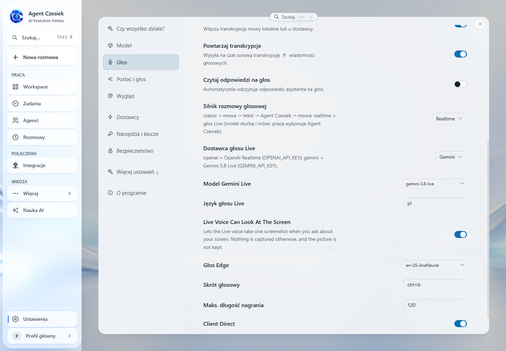

W **Głos** wybierz głos i odsłuchaj próbkę. W **Więcej ustawień głosu** skonfigurujesz silnik **Realtime**, dostawcę **Gemini**, identyfikator modelu Live oraz język. Gemini wymaga własnego klucza Google AI Studio. W repo ustawieniem domyślnym jest `gemini-3.8-live`; użyj identyfikatora rzeczywiście dostępnego na swoim koncie — samo domyślne ustawienie nie potwierdza jego dostępności u Google.

**ElevenLabs** ma własną zakładkę i własny klucz. Służy do wyboru głosów, podglądu i odczytu tekstu; nie zastępuje natywnego audio sesji Gemini Live. Klucz OpenRouter nie uwierzytelnia Gemini ani ElevenLabs.

</details>

<details>
<summary><strong>Integracje — Google, uprawnienia i test połączenia</strong></summary>

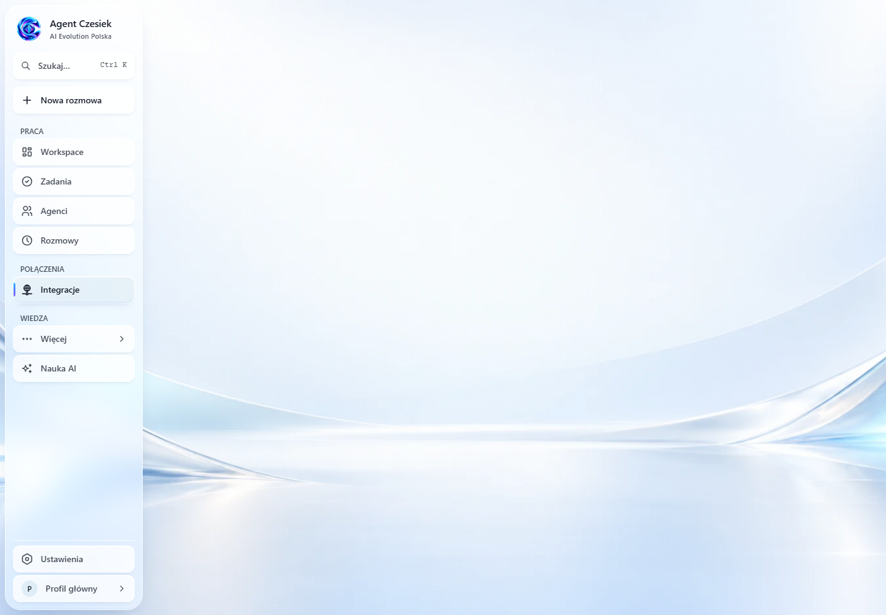

Gmail, Kalendarz i Dysk sprawdzaj osobno w kreatorze Google. Stan zapisanej konfiguracji nie oznacza jeszcze potwierdzonego połączenia. Wysyłka wiadomości i zmiana danych zależą od ustawionych zgód.

</details>

### Nauka AI

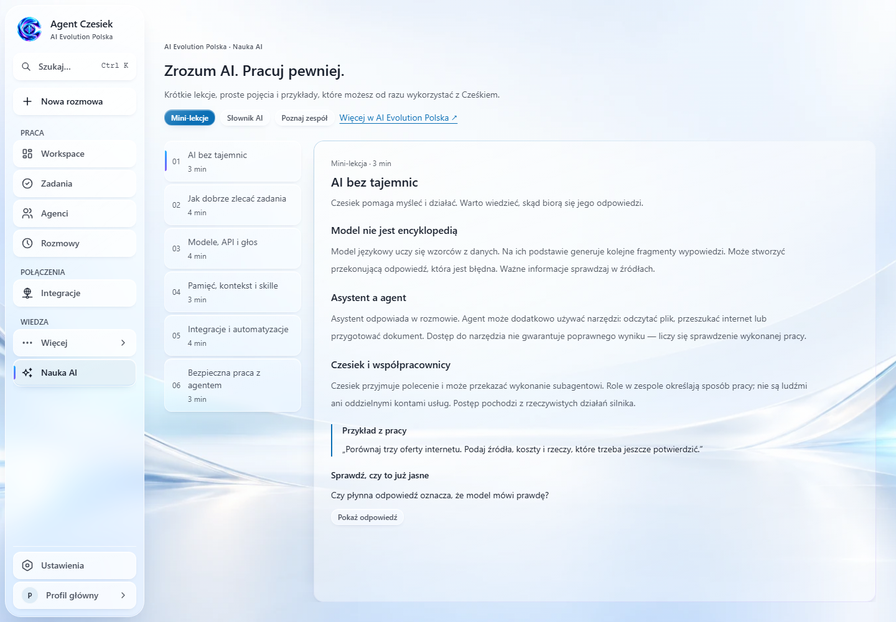

**Nauka AI** zawiera sześć mini-lekcji i wyszukiwalny słownik: modele, API, tokeny, prompty, pamięć, skille, MCP, OAuth oraz bezpieczna praca. Każda lekcja ma przykład i pytanie z odpowiedzią. Dalszą naukę znajdziesz na [aievolutionpolska.pl](https://aievolutionpolska.pl).

## Pierwsze uruchomienie

### Instalacja

Pobierz wersję dla swojego systemu z [Releases](https://github.com/aievolutionpl/AGENT_CZESIEK/releases). Które pliki są w danym wydaniu, zobaczysz na tej stronie.

| System | Pakiet budowany przez pipeline | Uwagi |
| --- | --- | --- |
| **Windows** | Instalator NSIS (`.exe`) | Pełny pakiet zawiera silnik, Python, zależności, Git Bash i Node.js — nie wymaga wcześniej zainstalowanego Hermesa i nie pobiera silnika przy pierwszym starcie. Tworzy skrót **Agent Czesiek** na pulpicie i w menu Start. |
| **macOS** | `.dmg` i `.zip` (osobno arm64 i x64) | DMG ze wbudowanym silnikiem; wariant `--online` jest mniejszy, ale doinstaluje silnik przy pierwszym starcie. |
| **Linux** | `.AppImage`, `.deb`, `.rpm` | Silnik jest przygotowywany przy pierwszym starcie (wymaga internetu). |

Szczegóły i granice działania bez internetu: [instalacja na nowym komputerze](docs/CZESIEK_INSTALLATION.md). Co wiemy (i czego jeszcze nie) o podpisie instalatorów, opisują [Znane ograniczenia](#znane-ograniczenia).

### Pierwsze minuty

Onboarding to dziewięć kroków: powitanie, „Poznajmy się”, własne API i współpracownik, model pracy, głos, dostępy, komputer, integracje oraz zgody. W praktyce:

1. **Kliknij logo Cześka.** Krótka animacja i cichy dźwięk otworzą onboarding (dźwięk startuje dopiero po kliknięciu).
2. **Wybierz współpracownika** (silnik): nowy z pakietu albo wykrytą instalację Hermesa (możesz też wskazać folder). Czesiek zapamiętuje wybór i zawsze używa własnego profilu — nie kopiuje kluczy ani historii innego Hermesa.
3. **Wybierz rolę** (np. asystent dnia). Zaznaczy to polecane narzędzia; każdy wybór możesz zmienić.
4. **Podłącz model:** wklej własny klucz API (np. OpenRouter) albo zaloguj się kontem ChatGPT. Głos Live wymaga zgodnego dostawcy i osobnego klucza.
5. **Zdecyduj o dostępie** do komputera, integracjach i trybie zgód. Wrócisz do tego w Ustawieniach.
6. Na **Workspace** napisz polecenie lub rozpocznij rozmowę głosową. Przyciski **Zadania** i **Pamięć** otwierają panel; integracje skonfigurujesz w menu **Integracje**.

Kluczy API nie wpisuj w czacie ani w plikach repozytorium. Instrukcje uruchomienia ze źródeł: [Dla deweloperów](#dla-deweloperów).

## Workspace i nawigacja

### Menu główne

| Pozycja | Do czego służy |
| --- | --- |
| **Workspace** | Rozmowa i duży orb pokazujący rzeczywisty stan Cześka. |
| **Zadania** | Zaplanowane działania i ich statusy. |
| **Agenci** | Gotowe role i współpracownicy wykonujący zadania. |
| **Rozmowy** | Historia i powrót do poprzedniej rozmowy. |
| **Integracje** | Google i inne połączone usługi. |
| **Więcej** | Pamięć i mapa wiedzy, Pliki i wyniki, Moje prompty, Umiejętności, Automatyzacje, Monitor systemu. |

**Nowa rozmowa** ma własny przycisk nad menu. Na dole znajdują się profil i Ustawienia. Język oraz motyw wybierzesz w ustawieniach wyglądu. Nowy profil zaczyna po polsku i w jasnym trybie; zapisane preferencje pozostają zachowane.

### Prawy panel

Panel jest domyślnie zamknięty. **Zadania** na górze pulpitu otwierają rzeczywistą aktywność, statystyki i krótkie podpowiedzi. **Pamięć** otwiera notatki bieżącego profilu. Możesz go zamknąć, a aplikacja zapamięta wybór. Nowe zdarzenia nie otwierają go samoczynnie. **Opcje rozmowy** zawierają model do zadań i przejście do ustawień głosu. **Kula na pulpicie** zachowuje istniejącą rozmowę w nakładce Electron.

### Raport dnia

Z menu „więcej” na pulpicie albo słowami **„Tatuś wrócił”** Czesiek zagra swój motyw i opowie, co się dzieje: otwarte zadania z tablicy, newsy, ostatnie sesje i zadania cykliczne, a po połączeniu Google także dzisiejsze spotkania i nieprzeczytane maile. Treść maili trafia do modelu jako dane, nie jako polecenia.

## Rozmowa głosowa i orb

Orb pokazuje, co się dzieje: czy Czesiek czeka, słucha, myśli, pracuje, potrzebuje Twojej zgody albo mówi.

| Stan | Co oznacza |
| --- | --- |
| Czeka | Możesz zacząć rozmowę lub podać kolejne zadanie. |
| Słucha | Sesja głosowa odbiera Twoją wypowiedź. |
| Myśli | Trwa przygotowywanie odpowiedzi lub planu. |
| Pracuje | Agent wykonuje zadanie; szczegóły sprawdzisz w rozmowie. |
| Potrzebuje zgody | Dalszy krok wymaga Twojej decyzji. |
| Odpowiada | Trwa wypowiedź głosowa Cześka. |
| Błąd | Sprawdź komunikat i stan połączenia. |

Podczas rozmowy pulpit zostawia orba, małą falę dźwięku (z realnego poziomu mikrofonu) i dolny dok: wyciszenie mikrofonu (widoczne w trakcie rozmowy), wyciszenie głosu asystenta oraz start/koniec rozmowy. Pozostałe sterowanie (przełączniki modeli, menu „więcej”, panele) jest po bokach paska górnego.

**Kula na pulpicie.** Osobne, przezroczyste okno z orbem. Rozmiar zmienisz kółkiem myszy nad kulą, uchwytem na krawędzi albo przyciskami −/+; kula nie ucieka poza ekran i po puszczeniu przy krawędzi się do niej „przykleja”. Rozmiar jest wspólny dla obu okien. Dostępność okna i mikrofonu zależy od systemu i jego uprawnień. Sama animacja nie potwierdza, że połączenie z usługą głosową działa.

**Dwa tryby głosu.** *Głos klasyczny* łączy rozpoznawanie mowy, odpowiedź modelu i syntezę. *Głos Live* korzysta z obsługiwanego połączenia głosowego dostawcy (np. Gemini Live lub OpenAI Realtime). Domyślne głosy są męskie, a w ustawieniach głosu każdy możesz odsłuchać przed wyborem.

**Oczy.** Czesiek może spojrzeć na Twój ekran, gdy o to poprosisz. Funkcja jest domyślnie włączona i wyłączysz ją w ustawieniach głosu; przed zrzutem pojawia się komunikat na ekranie.

**Dźwięki interfejsu** (ciche, generowane w aplikacji) wyłączysz w Ustawienia → Wygląd; przycisk wyciszenia na pasku tytułu wycisza wszystko.

Przed pierwszą rozmową:

1. Wybierz dostawcę i model dostępny na swoim koncie.
2. Zapisz odpowiedni klucz w ustawieniach.
3. Zezwól aplikacji na mikrofon i wybierz właściwe urządzenie.
4. Rozpocznij rozmowę i sprawdź, czy słyszysz odpowiedź.

Nie zakładamy dostępności modelu na podstawie jego nazwy marketingowej: dostawca musi udostępniać wybrany identyfikator modelu i wymagany tryb Live na Twoim koncie.

## Agenci, subagenci i tablica pracy

Czesiek jest rozmówcą i koordynatorem: ustala cel, dopytuje o braki i przekazuje wykonanie współpracownikowi. Narzędzie delegowania musi być dostępne na wybranym backendzie.

W **Agentach** znajdziesz gotowych współpracowników biurowych:

| Współpracownik | Charakter | Przykładowa praca |
| --- | --- | --- |
| **Maja · Marketing** | Pogodna, kreatywna, konkretna | Pomysły na posty, teksty i plan publikacji do akceptacji. |
| **Kuba · Sprzedaż** | Komunikatywny, rzeczowy | Szkic oferty, pytania do klienta i follow-up. |
| **Iga · Analiza** | Dociekliwa, spokojna | Porównania, źródła i rekomendacje bez zmyślonych statystyk. |
| **Ola · Obsługa klienta** | Empatyczna, cierpliwa | Odpowiedzi na reklamacje i instrukcje pomocy. |
| **Bartek · Organizacja** | Uporządkowany, praktyczny | Priorytety, checklisty i procedury zespołu. |
| **Lena · Produkt i kod** | Pomysłowa, techniczna | Prototypy, analiza problemów i sprawdzalne zmiany w kodzie. |

Pozostają też role ogólne: asystent dnia, koordynator projektu i researcher. Zapisane wcześniej własne role nie są nadpisywane nowymi szablonami.

Wybierz rolę, wpisz cel i kliknij **Przygotuj zadanie**. Aplikacja otworzy nową rozmowę z instrukcją do wysłania — możesz ją przeczytać i poprawić przed startem. Edytor pozwala zmieniać charakter, dział, avatar i przypisane skille. Czesiek przekazuje instrukcje wybranemu subagentowi i zachowuje rolę koordynatora. Sama rola nie instaluje integracji ani nie nadaje nowych uprawnień.

**Tablica pracy w rozmowie głosowej.** Zlecenia z głosu trafiają na tablicę (kanban) jako zadania z oznaczeniem pochodzenia. Aplikacja co kilka sekund sprawdza ich stan i sama wraca z raportem dla zadań z tej rozmowy. Możesz w dowolnym momencie zapytać o status, poprosić o zatrzymanie albo zmienić polecenie aktywnym współpracownikom. Karty pokazują stan z backendu, raport i zapisane pliki, jeśli współpracownik je zgłosił. Raporty głosowe dotyczą bieżącej rozmowy; wyniki pozostałych zadań znajdziesz w historii.

Przygotowanie wiadomości nie oznacza jeszcze uruchomienia subagenta — potwierdzeniem są działania i wyniki widoczne w sesji.

## Własne skille

**Skill to instrukcja wykonania powtarzalnej pracy**: sposób przygotowania raportu, styl marki, procedura analizy dokumentów. Nie zmieniasz kodu aplikacji, żeby ją dodać.

1. Otwórz **Narzędzia → Umiejętności** i wybierz profil.
2. Wejdź do [katalogu AI Evolution](https://skills-pack-ai-evolution.tabascocreatives.chatgpt.site/) i skopiuj treść wybranego skilla.
3. Kliknij **Wklej lub utwórz skilla**. Wklej instrukcję, podaj nazwę, kategorię i krótki opis zastosowania (do 60 znaków).
4. Kliknij **Sprawdź podgląd**, a potem **Dodaj skilla**.
5. Rozpocznij nową rozmowę, aby korzystać ze zmienionego zestawu instrukcji.

Możesz też napisać instrukcję od zera albo wkleić pełny plik `SKILL.md`. Zapis przechodzi walidację i skanowanie istniejącego mechanizmu skilli, a duplikaty są odrzucane zamiast nadpisywać.

> Wklej **treść**, nie sam adres strony. Kopiowanie tekstu nie przenosi skryptów ani plików pomocniczych. Skill opisuje sposób działania, ale nie dodaje kont, kluczy ani uprawnień do zewnętrznych usług.

Zmiana skilli nie przebudowuje kontekstu trwającej rozmowy (chroni to jej pamięć podręczną i koszt) — dlatego zacznij nową sesję. Pełna instrukcja: [własne umiejętności i role](docs/SKILLS_AND_ASSISTANT.md).

## Pamięć, mapa wiedzy i profile

Cztery rzeczy o różnych zadaniach:

- **Historia** przechowuje przebieg sesji, do którego możesz wrócić.
- **Wspomnienia** to lista zapisanych informacji o sposobie pracy i dotychczasowych ustaleniach. Szybką notatkę zapiszesz też z karty **Pamięć** na pulpicie.
- **Mapa wiedzy** pokazuje notatki jako graf: węzły to notatki Markdown, krawędzie to `[[wikilinki]]`. Notatkę otworzysz, zredagujesz, utworzysz lub usuniesz (usunięte trafiają do `.trash`); edytor pyta o niezapisane zmiany. Sam widok niczego nie dopisuje.
- **Profile** rozdzielają konfigurację i dane różnych sposobów pracy. Wybieraj profil świadomie, także przy dodawaniu skilli.

### Vault Obsidiana

Pamięć ogólna to zwykły folder z plikami Markdown — **Documents/Czesiek Vault** (Windows: `%USERPROFILE%\Documents\Czesiek Vault`; zmienisz go zmienną `OBSIDIAN_VAULT_PATH`). Możesz otwierać go w Obsidianie i edytować ręcznie; to wspólny zeszyt, nie zamknięty system. Ścieżki poza vaultem są odrzucane.

Instalator Windows próbuje zainstalować Obsidiana (przez winget lub z oficjalnego źródła), a macOS robi to w tle przy pierwszym starcie. Porażka tego kroku nie przerywa instalacji Cześka. Obsidiana nie dołączamy do paczki ani do repozytorium. Szczegóły: [docs/CZESIEK_INSTALLATION.md](docs/CZESIEK_INSTALLATION.md#pamięć-ogólna-cześka-vault--obsidian).

### Dane i izolacja

Dane Cześka leżą w osobnym katalogu: Windows `%LOCALAPPDATA%\AI Evolution Jarvis\hermes-home`, macOS i Linux `~/.ai-evolution-jarvis/hermes-home`. Historyczna nazwa folderu została dla zgodności z aktualizacjami. Istniejące instalacje Hermesa mają własne dane — przed przełączeniem backendu sprawdź, z którym środowiskiem pracujesz.

## Integracje i modele

Model do zadań, głos i połączone usługi to oddzielne ustawienia.

### Co zmieniło się w tym wydaniu

[Wyniki odbioru i ograniczenia tego wydania](docs/product/CLEAR_DESKTOP_VALIDATION.md).

- Krótsze menu, spokojne mleczne szkło i otwierany panel zadań/pamięci.
- Orb dopasowuje się do miejsca nad paskiem rozmowy; kolory i podpisy wynikają ze zdarzeń pracy i audio.
- **Głos i rozmowa**: Gemini Live oraz osobny katalog głosów ElevenLabs z wyszukiwaniem i odsłuchem po polsku. Zmiana próbki, profilu lub zamknięcie ekranu zatrzymują poprzedni odsłuch.
- Karta Google pokazuje osobny wynik testu Gmail, Kalendarza i Dysku. Test czyta wyłącznie minimalne metadane, nie wysyła poczty ani nie zmienia plików.

### Modele i głos

| Połączenie | Zastosowanie | Co przygotować |
| --- | --- | --- |
| **ChatGPT** | Model zadaniowy przez logowanie kontem | Subskrypcja z dostępem do modeli; aplikacja wybiera najnowszy dostępny GPT. |
| **OpenRouter** | Dostęp do modeli różnych dostawców (np. DeepSeek) | Własny klucz, środki i dostępny model. |
| **OpenAI API** | Modele OpenAI; głos Realtime | Klucz API i uprawnienia do wybranego modelu. |
| **Gemini API** | Modele Google i tryb Live | Klucz oraz model zgodny z daną funkcją. |
| **Inni dostawcy** | Alternatywny model lub synteza mowy | Konfiguracja w ustawieniach danej funkcji. |

**Gemini Live** prowadzi bezpośrednią rozmowę audio. Model domyślny to "gemini-3.8-live"; dostęp konkretnego klucza trzeba sprawdzić w panelu „Czy wszystko działa?”. Głos Gemini zaczyna obowiązywać od następnej rozmowy. Lista głosów opiera się na [dokumentacji Google Live API](https://ai.google.dev/gemini-api/docs/live-guide).

**ElevenLabs** w tym wydaniu służy do próbek i czytania odpowiedzi. Nie zastępuje natywnego audio Gemini Live. Katalog pochodzi z Twojego konta, a klucz pozostaje po stronie silnika. Odsłuch może zużywać limit konta. Błąd nie przełącza Cię automatycznie na innego płatnego dostawcę.

**Google**: po konfiguracji OAuth kliknij „Przetestuj”. Gmail, Kalendarz i Dysk mogą mieć różne wyniki: połączono, brak uprawnień, ponowne logowanie, limit albo chwilowa niedostępność. Sam zapis tokenu nie potwierdza połączenia. Test nie pobiera treści maili ani dokumentów.

Automatyczne testy używają tymczasowych profili i zastępczego dostawcy. Prawdziwe konta Google, Gemini i ElevenLabs wymagają osobnego odbioru z autoryzowanymi danymi; lokalne testy nie są dowodem działania płatnych usług na Twoim koncie.

Nie musisz kupować dostępu do wszystkich dostawców. Zacznij od jednego modelu do tekstu, sprawdź rozmowę, potem dodaj głos i integracje. Dostępność logowania kontem zależy od dostawcy i planu — subskrypcja aplikacji konsumenckiej nie zawsze jest kluczem API.

### Usługi i narzędzia

- **Google (Gmail, Kalendarz, Dysk, Dokumenty, Arkusze).** Kreator w aplikacji prowadzi przez wskazanie pliku klienta OAuth i dwa kroki logowania, a na końcu robi prawdziwy test odczytu kalendarza i poczty; po przerwaniu wznawia od ostatniego kroku. Stan połączeń to tylko obecność plików i poświadczeń, bez sieci i bez ujawniania wartości.
- **Dysk → pamięć.** Wskazane foldery Dysku stają się notatkami `Drive/<folder>/*.md` w vaultcie, z linkiem do źródła; synchronizacja jest przyrostowa (wg daty modyfikacji).
- **Przeglądarka agenta.** Trzy tryby: zarządzana, własny profil z logowaniem do Google oraz kopia logowań z Chrome (czytane są tylko nazwy i hosty ciasteczek, nigdy wartości). Sterowanie codziennym profilem Chrome celowo nie jest oferowane — Chrome od wersji 136 blokuje tam zdalne debugowanie. W oknie przeglądarki widać kursor agenta z plakietką „Czesiek”. **Zablokowane strony** edytujesz w Ustawienia → Narzędzia → Przeglądarka i backend egzekwuje je przy nawigacji.
- **Katalog serwerów MCP** w Narzędziach oraz skille opcjonalne, np. Fakturownia (tylko odczyt).
- **Komunikatory i inne usługi** (Telegram, Discord, Slack i kolejne) przez gateway — wymagają autoryzacji, tokenu bota lub adaptera.

### Własne API Cześka

Czesiek może udostępnić **własne API zgodne z OpenAI**, żeby n8n, Make, Open WebUI, skrypty i Twoje aplikacje rozmawiały z nim razem z jego narzędziami, pamięcią i skillami — np. automatyzacja w n8n, która prosi o podsumowanie, albo skrypt pytający co rano o plan dnia. Włączysz je na stronie **Integracje → API Agenta Cześka** (kroki, adres, przykłady `curl` i Python są w aplikacji): uruchom API server w ustawieniach komunikatorów, ustaw długi, losowy klucz, a w kliencie wybierz „OpenAI-compatible” i model `hermes-agent`. Domyślnie API słucha tylko na tym komputerze (`127.0.0.1`). Wystawiaj je dalej wyłącznie z kluczem i przez bezpieczny tunel.

## Bezpieczeństwo i prywatność

**Jak daleko może pójść Czesiek.** Na stronie **Integracje** (pierwsza zakładka) ustawiasz poziom zaufania dla Google:

| Poziom | Co robi |
| --- | --- |
| **Tylko czyta** | Każde wysłanie, usunięcie i zmiana jest blokowane. |
| **Czyta i proponuje** | Mówi dokładnie, co by zrobił, ale nie może tego wykonać. |
| **Działa po zgodzie** (domyślny) | Pokazuje, co chce zrobić, i czeka na Twoje „tak”. |
| **Działa sam** | Wysyła, tworzy i usuwa bez pytania — tylko dla rzeczy, którym w pełni ufasz. |

Karta **Co Czesiek zrobił ostatnio** to dziennik decyzji (zatwierdzone, odrzucone, zablokowane, zrobione samodzielnie). Podgląd pokazuje adresata i temat wiadomości, nigdy jej treści. Blokady i pytanie o zgodę obowiązują także w trybie bez pytań, a zadania bez nadzoru (np. cykliczne) przy poziomie „po zgodzie” są blokowane zamiast zatwierdzać się same. Na razie poziomy obejmują zapisy przez Google; pozostałe usługi są tylko do odczytu.

**Treści od innych to dane, nie polecenia.** Maile, newsy, pliki z Dysku i tekst od współpracowników trafiają do modelu w znaczniku „dane zewnętrzne” z zasadą, że nie wykonuje on zawartych w nich instrukcji.

**Klucze.** Zapisuj je tylko w polach aplikacji. Audyt (Integracje → zakładka **Klucze API**) sprawdza, jakie pliki z poświadczeniami istnieją, bez odczytu wartości, i jednym kliknięciem ustawia uprawnienia tylko dla właściciela. Magazyn kluczy systemu operacyjnego nie jest jeszcze zaimplementowany.

**Co opuszcza komputer.** Połączenie z modelem w chmurze przekazuje mu treść potrzebną do zadania; w trybie Live do dostawcy głosu płynie dźwięk rozmowy. Jeśli poprosisz Cześka o spojrzenie na ekran, zależnie od skonfigurowanego modelu wizyjnego obraz może trafić do dostawcy w chmurze. Lokalna aplikacja nie oznacza przetwarzania całkowicie offline. Dostęp do plików, przeglądarki i terminala wynika z konfiguracji narzędzi oraz zgód.

Zgłoszenia podatności: [SECURITY.md](SECURITY.md).

## Co można zautomatyzować

Po skonfigurowaniu połączeń możesz poprosić Cześka na przykład o:

- **Poranny plan pracy:** zebrać wydarzenia z kalendarza i ważne wiadomości, przygotować listę priorytetów.
- **Przegląd projektów:** raz w tygodniu podsumować zgłoszenia i pull requesty na GitHubie i wskazać sprawy do decyzji.
- **Monitoring informacji:** sprawdzać wybrane strony, wyłapywać zmiany i wysyłać powiadomienie.
- **Pracę z dokumentami:** porównać pliki, streścić, wyciągnąć zadania i zapisać wynik.
- **Porządkowanie danych:** przygotować plan uporządkowania folderu lub zestawienia faktur i wykonać zmiany po Twoim potwierdzeniu.
- **Raport z rozmowy:** zebrać ustalenia, otwarte pytania i następne kroki.

Zadanie cykliczne ustawisz w **Zadaniach** albo **Automatyzacjach**. Dostęp do poczty, kalendarza, GitHuba i komunikatorów włączasz oddzielnie w **Integracjach**. Wyniki znajdziesz w **Plikach i wynikach**, a wcześniejsze ustalenia w **Historii** i **Wspomnieniach**.

## Diagnostyka, aktualizacje i kopie

**Czy wszystko działa?** W Ustawienia → *Czy wszystko działa?* sprawdzisz połączenie z Hermesem, zapisanie kluczy API i konfigurację narzędzi. Osobne przyciski testują mikrofon, głośnik i prawdziwą rozmowę z dostawcą. Zapisany klucz nie oznacza poprawnego połączenia; test rozmowy wymaga internetu i może zużyć środki API. „Napraw połączenie” uruchamia połączenie ponownie — wcześniej zakończ aktywne zadania.

**Aktualizacje.** Zainstalowana aplikacja nie ma checkoutu gita, więc w Ustawienia → O aplikacji przycisk „Sprawdź aktualizacje” czyta ostatnie Wydanie z GitHuba, porównuje wersje i otwiera instalator dla Twojego systemu. Błąd 404 oznacza prywatne repozytorium albo brak wydania — aplikacja mówi to wprost. Wbudowana ścieżka aktualizacji Windows zapisuje kopię przed przekazaniem sterowania aktualizatorowi. Zewnętrznej instalacji Hermesa Czesiek nie aktualizuje.

**Kopie i przywracanie (pełny pakiet Windows).** Możesz zapisać lokalną kopię aplikacji, kluczy, ustawień, historii i pamięci i przywrócić ją także z ekranu błędu startu. Kopia wymaga dodatkowego miejsca na dysku i zatrzymania zadań. **Przed ręcznym uruchomieniem nowego instalatora EXE kliknij „Zapisz kopię”.** Po starcie sprawdzane są HTTP i WebSocket backendu. Przywrócenie uruchamiasz samodzielnie; aktualne dane zostają zachowane osobno.

Podpisywanie i test instalacji na czystym Windows: [instrukcja wydania](docs/RELEASE_SIGNING.md).

## Rozwiązywanie problemów

| Objaw | Od czego zacząć |
| --- | --- |
| Okno działa, ale agent nie odpowiada | Ustawienia → *Czy wszystko działa?*; sprawdź backend, dostawcę, zapisany klucz, saldo i dostępność modelu. |
| `timeout` lub `Connection error` | Sprawdź sieć i status dostawcy. Zachowaj nazwę modelu i czas błędu; nie publikuj klucza. |
| Nie słychać Cześka | Sprawdź wyjście audio, głośność, wyciszenie asystenta, konfigurację syntezy/Live i komunikat sesji. |
| Czesiek nie słyszy Ciebie | Sprawdź uprawnienia systemowe, wybrany mikrofon i rozpoczęcie sesji głosowej. |
| Skill nie pojawia się w rozmowie | Sprawdź profil i wynik zapisu, potem rozpocznij nową sesję. |
| Zadanie nie zostało delegowane | Sprawdź dostępność narzędzia delegowania i jego wynik w rozmowie. |
| Zadanie „wisi” bez raportu | Sprawdź jego kartę i tablicę pracy; po 15 minutach ciszy jest oznaczane jako zawieszone. |
| Pamięć lub mapa są puste | Sprawdź wybrany profil oraz ścieżkę vaultu (`OBSIDIAN_VAULT_PATH`). |
| Google pokazuje błąd | Wznów kreator od ostatniego kroku; test odczytu wskaże, czy zawiodło logowanie, czy uprawnienia. |
| README nie pokazuje obrazów | Otwórz link do pliku pod zrzutem. Błąd 429 oznacza limit żądań; 404 — nieistniejący adres. |

Zgłoszenie błędu powinno zawierać system, wersję aplikacji, kroki odtworzenia i komunikat bez sekretów. [Zgłoś problem](https://github.com/aievolutionpl/AGENT_CZESIEK/issues).

## Dla deweloperów

> **Gdzie wysyłać zmiany.** Push i pull requesty tylko do `aievolutionpl/AGENT_CZESIEK` (base: `main`). Nigdy do `NousResearch/hermes-agent`, nawet jeśli GitHub domyślnie proponuje repo nadrzędne forka. Zmiany z upstreamu wciąga się do tego repo, nie odwrotnie.

### Uruchomienie ze źródeł

Potrzebujesz Gita, Pythona 3.11–3.13 i Node.js 22.22+, 24.11+ albo 26+ (zgodnie z `engines` w `apps/desktop/package.json`).

```bash
git clone https://github.com/aievolutionpl/AGENT_CZESIEK.git
cd AGENT_CZESIEK
npm install
cd apps/desktop
npm run dev
```

Pełny pakiet Windows uruchamia dołączony backend bez instalowania zależności; wersje deweloperskie i pozostałe platformy mogą wymagać pobrania środowiska. Dane profilu i klucze nie należą do katalogu ze źródłami. Szczegóły: [docs/AGENT_SETUP.md](docs/AGENT_SETUP.md).

Przy pracy ze źródłami sam silnik można przygotować na Windows przez [scripts/install.ps1](scripts/install.ps1). Do zwykłego korzystania z Cześka wybierz pełny instalator aplikacji z Wydania.

### Sprawdzenie zmian

Z katalogu `apps/desktop`:

```bash
npm run typecheck
npm run lint
npm run test:ui
npm run test:desktop:platforms
npm run build
```

Testy Pythona uruchamiaj z katalogu głównego **wyłącznie** przez projektowy runner (na Windows w Git Bash):

```bash
scripts/run_tests.sh tests/hermes_cli/test_web_server_skill_editor.py
```

Runner izoluje dane profilu i środowisko testów. Lista poleceń nie jest deklaracją, że cała bieżąca gałąź ma wszystkie testy zielone — wyniki sprawdzaj w [GitHub Actions](https://github.com/aievolutionpl/AGENT_CZESIEK/actions).

### Budowa instalatorów

```bash
cd apps/desktop
npm run dist:win     # Windows (NSIS)
npm run dist:mac     # macOS
npm run dist:linux   # AppImage, deb, rpm
```

Na macOS całość załatwia jedna komenda z katalogu głównego repozytorium (domyślnie DMG ze wbudowanym silnikiem; `--online` daje mniejszy DMG, `--sign` podpisuje certyfikatem Developer ID):

```bash
scripts/build-macos-installer.sh
```

Scalenie kodu i publikacja instalatora to dwa osobne kroki: zainstalowana aplikacja może mieć inną wersję niż `main`. Zasady wydania: [pipeline publikacji](docs/product/RELEASE_PIPELINE.md) i bramka `apps/desktop/scripts/verify-release-gate.mjs`.

### Mapa kodu

Zacznij od [mapy repozytorium](docs/REPO_MAP.md), wybierz obszar i przeczytaj jego `AGENTS.md`. Nie trzeba skanować całego projektu, żeby poprawić jeden ekran. Zasady wspólne: [AGENTS.md](AGENTS.md).

| Obszar kodu | Odpowiedzialność |
| --- | --- |
| `apps/desktop/` | Okno, interfejs, onboarding, orb, ustawienia, pakowanie. |
| `apps/shared/`, `tui_gateway/` | Komunikacja interfejsu z backendem (JSON-RPC). |
| `agent/`, `run_agent.py` | Pętla rozmowy, pamięć, vault, połączenia, zaufanie, treści zewnętrzne. |
| `tools/`, `plugins/`, `skills/` | Narzędzia i rozszerzenia możliwości. |
| `gateway/`, `cron/` | Kanały komunikacji i zadania cykliczne. |
| `hermes_cli/`, `web/` | Konfiguracja, API (`web_routers/`), tablica pracy głosu i panel webowy. |
| `sales-site/` | Osobna, statyczna strona prezentująca produkt. |

### Upstream i zgodność

Repozytorium jest dystrybucją silnika Hermes Agent. `scripts/upstream_watch.py` i workflow `upstream-watch` (co poniedziałek) zbierają zmiany z upstreamu od ostatniego przeglądu, pogrupowane po obszarach, z plikami zmienionymi po obu stronach (tam będą konflikty). Wynik trafia do jednego zgłoszenia z etykietą `upstream-watch`; nic nie jest scalane automatycznie. Identyfikatorów instalacji, protokołu i profili nie zmieniaj tylko po to, by usunąć starszą nazwę — mogą być potrzebne do zgodności z aktualizacjami.

## Znane ograniczenia

Lista celowo uczciwa — to, czego nie należy zakładać:

- **Podpisany instalator.** Zielony test lokalny ani scalony PR nie potwierdzają podpisanego instalatora. Konfiguracja bez certyfikatu to nie podpis ani zakończony test na czystym systemie ([instrukcja wydania](docs/RELEASE_SIGNING.md)). macOS bez `--sign` ma podpis ad-hoc, tylko do testów.
- **Zrzuty ekranu:** pulpit i pamięć pochodzą z aktualizacji z października 2026; powitanie z PR #61. Testowy backend nie potwierdza działania płatnych API.
- **Google.** Logowanie jednym kliknięciem przez własną aplikację OAuth marki wymaga weryfikacji Google i nie jest zrobione — korzystasz z własnego pliku klienta OAuth.
- **Poziomy zaufania** obejmują na razie zapisy przez Google.
- **Klucze** nie mają jeszcze magazynu w kluczu systemu operacyjnego.
- **Fakturownia** jest tylko do odczytu i nie była uruchomiona na prawdziwym koncie.
- **Delegowanie** wymaga dostępnego narzędzia na wybranym backendzie; przygotowanie zadania nie jest jego uruchomieniem.
- **Praca offline** dotyczy instalacji i lokalnego backendu. Modele w chmurze, głos Live i integracje wymagają internetu i własnych kluczy.
- **Strona produktu** (`sales-site/`): merge nie potwierdza publikacji hostingu; nie ma jeszcze cennika ani płatności.

## Co nowego

### Wersja testowa 0.17.6-rc.1

Workspace z czytelniejszym menu, biuro sześciu firmowych specjalistów, edytor własnych agentów i animowane avatary. Nowa sekcja Nauka AI, szybkie style współpracy w onboardingu oraz ustawienia profilu zapisane dla konkretnego połączenia i profilu. README zawiera nowe screenshoty i przewodnik po modelach pracy, głosie oraz integracjach.

To wydanie do testów. Bez firmowego certyfikatu instalator Windows może wyświetlić ostrzeżenie SmartScreen. Nie traktujemy go jako podpisanego wydania produkcyjnego; stan podpisu i pakietów sprawdzaj w notatkach wydania.

Najnowszy [przegląd interfejsu i integracji](docs/product/POLISH_BRAND_EXPERIENCE.md) opisuje nowe tła jasne i ciemne, branding AI Evolution Polska, czytelniejsze ustawienia, wyszukiwanie modeli pracy i izolację synchronizacji Dysku. Polecane modele pojawiają się tylko wtedy, gdy udostępnia je podłączony dostawca. Wcześniej poprawiliśmy [zapis pamięci i orb](docs/product/PRODUCT_POLISH_2026_10.md). Pełna historia: [git log](https://github.com/aievolutionpl/AGENT_CZESIEK/commits/main) i [Releases](https://github.com/aievolutionpl/AGENT_CZESIEK/releases).

| PR | Co obejmuje |
| --- | --- |
| [#93](https://github.com/aievolutionpl/AGENT_CZESIEK/pull/93) | Głos Live: tablica pracy (zlecenia, raporty, sterowanie), „oczy”, prawy panel z kartami i prostszy ekran głosu. |
| [#92](https://github.com/aievolutionpl/AGENT_CZESIEK/pull/92) | Poziomy zaufania i dziennik decyzji dla Google, logowanie kontem ChatGPT, poprawka tickera newsów (#24). |
| [#91](https://github.com/aievolutionpl/AGENT_CZESIEK/pull/91) | Karta „Zacznij tutaj” i podpowiedzi zależne od połączeń. |
| [#90](https://github.com/aievolutionpl/AGENT_CZESIEK/pull/90) | Ikony modeli, ramki z gradientem, szklane przyciski czatu, animacje. |
| [#89](https://github.com/aievolutionpl/AGENT_CZESIEK/pull/89) | Instalator macOS: DMG z wbudowanym silnikiem, skrypt budujący, Obsidian w tle. |
| [#88](https://github.com/aievolutionpl/AGENT_CZESIEK/pull/88) | Treści zewnętrzne w pamięci jako niezaufane, audyt sekretów. |
| [#87](https://github.com/aievolutionpl/AGENT_CZESIEK/pull/87) | Zadania w raporcie dnia, Dysk Google → pamięć, skill Fakturownia. |
| [#86](https://github.com/aievolutionpl/AGENT_CZESIEK/pull/86) | Tryby przeglądarki agenta: własny profil z logowaniem, import logowań z Chrome. |
| [#85](https://github.com/aievolutionpl/AGENT_CZESIEK/pull/85) | Kreator Google z prawdziwym testem, role w onboardingu, „Połącz więcej”, blokada stron. |
| [#84](https://github.com/aievolutionpl/AGENT_CZESIEK/pull/84) | Kula na pulpicie z regulowanym rozmiarem, dźwięki interfejsu, kolory menu. |
| [#83](https://github.com/aievolutionpl/AGENT_CZESIEK/pull/83) | Własne repo jako źródło aktualizacji, sprawdzanie wydań w aplikacji, monitor upstream. |
| [#80–#82](https://github.com/aievolutionpl/AGENT_CZESIEK/pull/80) | Vault Obsidiana w Mapie wiedzy, prawy panel z pamięcią i newsami, poprawki pamięci i menu. |
| [#78–#79](https://github.com/aievolutionpl/AGENT_CZESIEK/pull/78) | Mózg i pamięć, widoczny agent (okno przeglądarki, kursor), czysty pulpit. |
| [#76–#77](https://github.com/aievolutionpl/AGENT_CZESIEK/pull/76) | Asynchroniczna orkiestracja Hermesa z głosu. |
| [#72–#73](https://github.com/aievolutionpl/AGENT_CZESIEK/pull/72) | Wybór współpracownika przy pierwszym starcie, diagnostyka, raporty w tle, kopie. |
| [#69–#71](https://github.com/aievolutionpl/AGENT_CZESIEK/pull/69) | Instalator Windows z dołączonym silnikiem, ikony, poprawki pierwszego startu. |
| [#61–#67](https://github.com/aievolutionpl/AGENT_CZESIEK/pull/61) | Ekran powitalny z logo, uproszczone ustawienia, mapa repozytorium, własne skille i role, strona produktu. |

## Licencje i kontakt

**Użytek prywatny i niekomercyjny.** Osoba prywatna może zainstalować aplikację, korzystać z niej prywatnie i edukacyjnie, testować funkcje oraz używać jej w niezarobkowych projektach hobbystycznych. Warunki korzystania z autorskich elementów marki opisuje [Personal & Non-Commercial License](CZESIEK-ASSETS-LICENSE.md).

**Użytek komercyjny.** Korzystanie z autorskich elementów marki Agent Czesiek w firmie, agencji, płatnych zleceniach, wewnętrznych procesach biznesowych, produktach dla klientów, white-labelingu, hostingu, SaaS, płatnych wdrożeniach lub pakietach z innym produktem wymaga odrębnej zgody albo [Commercial License](CZESIEK-ASSETS-LICENSE.md).

**Ważne rozróżnienie.** Te warunki dotyczą autorskiego logo i materiałów AI Evolution Polska, a nie zmieniają uprawnień przyznanych przez licencje komponentów zewnętrznych. Kod Hermes Agent © 2025 Nous Research jest na [licencji MIT](LICENSE), która zachowuje własne warunki, w tym prawo do użycia komercyjnego. Pozostałe komponenty zachowują swoje licencje. Wszystkie prawa do autorskich elementów nieudzielone wprost są zastrzeżone.

Agent Czesiek jest rozwijany i dystrybuowany przez **AI Evolution Polska — [aievolutionpolska.pl](https://aievolutionpolska.pl)**. W sprawie licencji i korzystania komercyjnego napisz na **[kontakt@aievolutionpolska.pl](mailto:kontakt@aievolutionpolska.pl)**. Błędy i propozycje: [GitHub Issues](https://github.com/aievolutionpl/AGENT_CZESIEK/issues).
