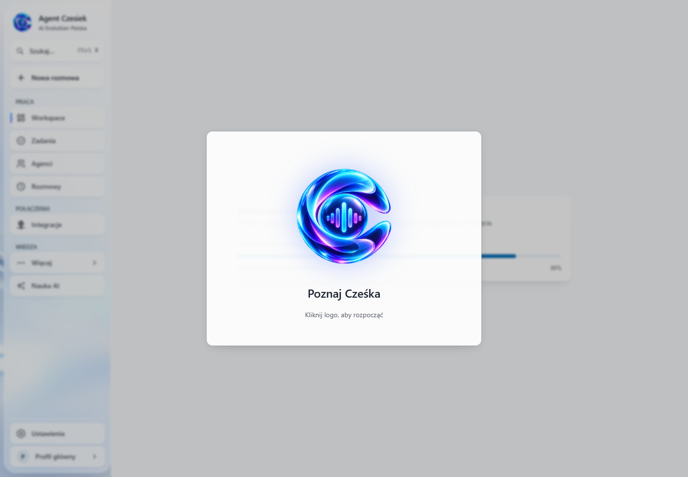
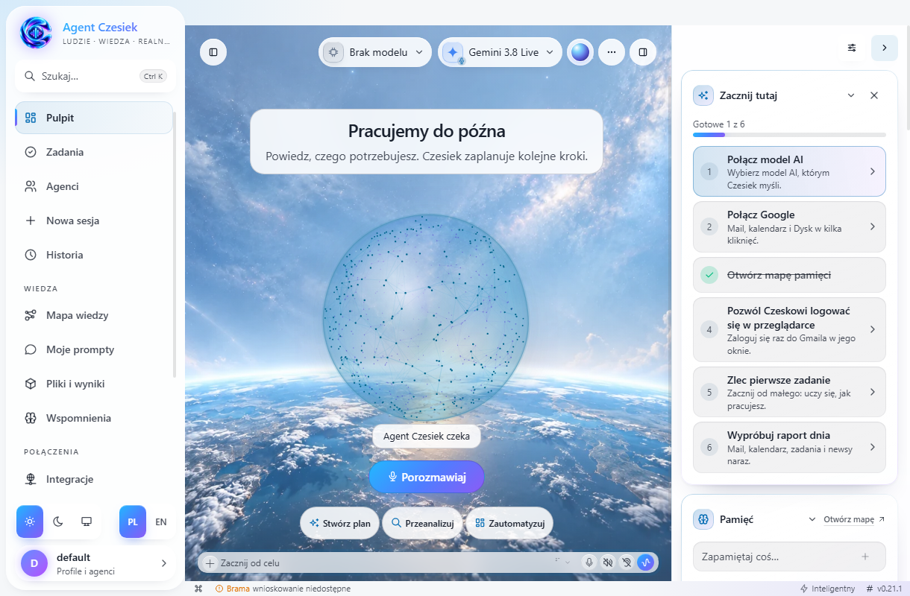
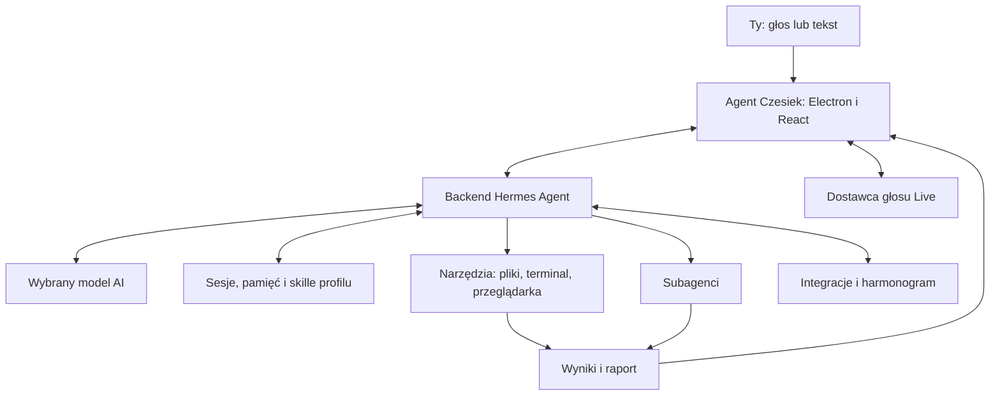

<div align="center">


# Agent Czesiek

**Desktopowy asystent do rozmów, zadań i automatyzacji.**

[](apps/desktop) [](https://github.com/NousResearch/hermes-agent) [](#licencje)

</div>

<p align="center">
  <a href="https://github.com/aievolutionpl/AGENT_CZESIEK/releases">Pobierz aplikację</a> ·
  <a href="#pierwsze-uruchomienie">Zacznij tutaj</a> ·
  <a href="#własne-skille-kopiuj-wklej-i-dodaj">Dodaj własną umiejętność</a> ·
  <a href="docs/REPO_MAP.md">Mapa kodu</a>
</p>

> **Mówisz, co chcesz osiągnąć. Czesiek pomaga zaplanować pracę, używa narzędzi i pokazuje wynik.**
> Projekt rozwija AI Evolution Polska, korzystając z silnika Hermes Agent od Nous Research.

## Spis treści

- [Co robi Czesiek?](#co-robi-czesiek)
- [Tak wygląda aplikacja](#tak-wygląda-aplikacja)
- [Pierwsze uruchomienie](#pierwsze-uruchomienie)
- [Przewodnik po aplikacji](#przewodnik-po-aplikacji)
- [Rozmowa głosowa i orb](#rozmowa-głosowa-i-orb)
- [Czesiek i subagenci](#czesiek-i-subagenci)
- [Własne skille: kopiuj, wklej i dodaj](#własne-skille-kopiuj-wklej-i-dodaj)
- [Pamięć, historia i profile](#pamięć-historia-i-profile)
- [Integracje i własne API](#integracje-i-własne-api)
- [Co można zautomatyzować?](#co-można-zautomatyzować)
- [Jak jest zbudowany?](#jak-jest-zbudowany)
- [Uruchomienie ze źródeł](#uruchomienie-ze-źródeł)
- [Rozwiązywanie problemów](#rozwiązywanie-problemów)
- [Ostatnie aktualizacje](#ostatnie-aktualizacje)
- [Licencje](#licencje)

## Co robi Czesiek?

Czesiek jest jednym miejscem do rozmowy głosowej lub tekstowej z agentem. Możesz opisać cel zwykłym językiem; agent planuje kroki, korzysta z dostępnych narzędzi i może delegować część pracy innym agentom. W aplikacji zobaczysz rozmowy, zadania, pliki z wynikami, pamięć i mapę wiedzy. Przy działaniach wymagających zgody aplikacja prosi o potwierdzenie.

Żeby odpowiadać przez model w chmurze, potrzebny jest własny klucz API. Integracje z zewnętrznymi usługami wymagają ich osobnego skonfigurowania. Samo zainstalowanie programu nie łączy kont ani nie gwarantuje dostępu do każdej usługi.

| Potrzebujesz… | Jak pomaga Czesiek |
| --- | --- |
| Omówić pomysł | Rozmowa tekstowa lub głosowa, doprecyzowanie celu i plan kolejnych kroków. |
| Wykonać zadanie | Narzędzia do plików, terminala i przeglądarki oraz delegowanie pracy, zależnie od konfiguracji. |
| Wrócić do ustaleń | Historia rozmów, pamięć profilu i widok mapy wiedzy. |
| Powtarzać sprawdzony proces | Własne umiejętności, role asystentów i automatyzacje. |
| Mieć asystenta pod ręką | Pulpit z animowanym orbem oraz osobne, przesuwane okno kuli. |
| Zachować kontrolę | Widoczne działania narzędzi i tryb zgód konfigurowany w aplikacji. |

## Tak wygląda aplikacja

Poniższe zrzuty pochodzą z uruchomionej aplikacji Electron z testowym backendem, zapisanej przy PR #61. Nie są makietami ani nowymi zrzutami po PR #66. Na pulpicie nie ma wybranego modelu, ponieważ test nie używa prywatnego klucza API. Późniejsze poprawki menu, ustawień i skilli mogą zmieniać szczegóły względem tych zdjęć.

### Powitanie i konfiguracja



[Otwórz screenshot onboardingu w pełnym rozmiarze](docs/assets/czesiek/onboarding-start.png).

### Pulpit z orbem



[Otwórz screenshot pulpitu w pełnym rozmiarze](docs/assets/czesiek/pulpit.png). Obrazy znajdują się w repozytorium, więc są dostępne również po jego sklonowaniu. Jeśli GitHub chwilowo nie ładuje podglądu, użyj linku do pliku lub lokalnej kopii.

## Pierwsze uruchomienie

1. Pobierz wersję dla swojego systemu z [Releases](https://github.com/aievolutionpl/AGENT_CZESIEK/releases) i zainstaluj aplikację. Sprawdź numer najnowszego wydania na tej stronie.
2. Kliknij logo Cześka. Krótka animacja i cichy dźwięk otworzą onboarding. Dźwięk uruchamia się dopiero po kliknięciu.
3. Wybierz profil i dostawcę modelu. Wklej własny klucz API, np. OpenRouter, w kreatorze lub później w Ustawieniach. Głos Live wymaga zgodnego dostawcy i osobnego klucza.
4. Zdecyduj o dostępie do komputera, integracjach i trybie zgód. Możesz wrócić do tych ustawień później.
5. Otwórz Pulpit i napisz lub powiedz, co Czesiek ma zrobić.

Kluczy API nie wpisuj w czacie ani w plikach repozytorium. Instrukcje uruchomienia ze źródeł są w [README aplikacji desktopowej](apps/desktop/README.md), a szczegółowy przewodnik dla agentów w [docs/AGENT_SETUP.md](docs/AGENT_SETUP.md).

## Przewodnik po aplikacji

| Miejsce | Do czego służy |
| --- | --- |
| **Pulpit** | Początek rozmowy, orb i skróty do bieżącej pracy. |
| **Zadania** | Przegląd pracy, statusów i zaplanowanych działań. |
| **Agenci** | Wybór roli, edycja instrukcji i przygotowanie zadania dla asystenta. |
| **Rozmowy / Historia** | Powrót do wcześniejszych sesji i ich ustaleń. |
| **Pliki i wyniki** | Dostęp do materiałów powstałych podczas pracy. |
| **Pamięć** | Przegląd informacji zapisanych dla profilu. |
| **Mapa wiedzy** | Wizualny przegląd zapisanej wiedzy i dostępnych powiązań. |
| **Integracje** | Podłączanie usług i konfiguracja komunikatorów w jednym miejscu. |
| **Automatyzacje** | Zdarzenia i wyzwalacze; webhooki pozostają funkcją zaawansowaną. |
| **Narzędzia** | Biblioteka umiejętności i dostępne rozszerzenia. |
| **Monitor systemu** | Informacje diagnostyczne pomagające sprawdzić stan działania. |
| **Ustawienia** | Model, głos, wygląd, dostęp i konfiguracja aplikacji. |

## Rozmowa głosowa i orb

Orb jest wizualnym wskaźnikiem rozmowy i pracy. Pozwala szybko zauważyć, czy Czesiek czeka na Ciebie, słucha, przygotowuje odpowiedź czy wykonuje zadanie.

| Stan | Co oznacza |
| --- | --- |
| Czeka | Możesz rozpocząć rozmowę lub podać kolejne zadanie. |
| Słucha | Sesja głosowa odbiera Twoją wypowiedź. |
| Myśli | Trwa przygotowywanie odpowiedzi lub planu. |
| Pracuje | Agent wykonuje zadanie; szczegóły sprawdzisz w rozmowie. |
| Potrzebuje zgody | Dalszy krok wymaga Twojej decyzji. |
| Odpowiada | Trwa wypowiedź głosowa Cześka. |
| Błąd | Sprawdź komunikat i stan połączenia. |

W osobnym oknie kuli możesz przesunąć orba na pulpicie. Dostępność funkcji okna i mikrofonu zależy od systemu oraz jego uprawnień. Sama animacja nie jest potwierdzeniem, że połączenie z usługą głosową działa.

**Głos klasyczny** łączy rozpoznawanie wypowiedzi, odpowiedź modelu i syntezę mowy. **Głos Live** korzysta z obsługiwanego połączenia głosowego dostawcy, np. Gemini Live lub OpenAI Realtime. Konfigurację głosu sprawdź osobno od modelu używanego do zadań.

Przed pierwszą rozmową:

1. Wybierz dostawcę i model dostępny na swoim koncie.
2. Zapisz odpowiedni klucz w ustawieniach.
3. Zezwól aplikacji na korzystanie z mikrofonu i wybierz właściwe urządzenie.
4. Rozpocznij rozmowę i sprawdź, czy słyszysz odpowiedź.

Nie zakładamy dostępności modelu wyłącznie na podstawie jego nazwy marketingowej. Dostawca musi udostępniać wybrany identyfikator modelu oraz wymagany tryb Live na Twoim koncie.

## Czesiek i subagenci

Czesiek pełni rolę rozmówcy i koordynatora: pomaga ustalić cel, dopytuje o brakujące informacje i może przekazać wykonanie pracy subagentowi. Narzędzie delegowania musi być dostępne na wybranym backendzie.

W **Agentach** znajdziesz między innymi:

| Rola | Przykładowe zadanie |
| --- | --- |
| **Asystent dnia** | Uporządkuj moje priorytety i przygotuj plan na dzisiaj. |
| **Koordynator projektu** | Rozbij wdrożenie strony na kroki, zależności i pytania do decyzji. |
| **Researcher** | Porównaj trzy rozwiązania, podaj źródła i wskaż ograniczenia. |

Wybierz rolę, wpisz cel i kliknij **Przygotuj zadanie**. Aplikacja otworzy nową rozmowę z instrukcją do wysłania. Możesz ją przeczytać i poprawić przed rozpoczęciem pracy. W edytorze roli zmienisz charakter asystenta i przypiszesz nazwy własnych skilli.

Instrukcja prosi Cześka o delegowanie i raportowanie rzeczywistych wyników. Przygotowanie wiadomości nie oznacza jeszcze uruchomienia subagenta ani nie gwarantuje nieprzerwanej rozmowy głosowej podczas każdego zadania — potwierdzeniem są działania i wyniki widoczne w sesji.

## Własne skille: kopiuj, wklej i dodaj

**Skill to instrukcja wykonania powtarzalnej pracy.** Może opisywać sposób przygotowania raportu, styl Twojej marki albo procedurę analizy dokumentów. Nie musisz zmieniać kodu aplikacji, żeby dodać taką instrukcję.

1. Otwórz **Narzędzia → Umiejętności** i wybierz profil.
2. Wejdź do [katalogu AI Evolution](https://skills-pack-ai-evolution.tabascocreatives.chatgpt.site/) i skopiuj treść wybranego skilla.
3. Kliknij **Wklej lub utwórz skilla**. Wklej instrukcję, podaj nazwę, kategorię i krótki opis zastosowania.
4. Kliknij **Sprawdź podgląd**, a potem **Dodaj skilla**.
5. Rozpocznij nową rozmowę, aby korzystać ze zmienionego zestawu instrukcji.

Możesz też napisać instrukcję od zera albo wkleić pełny plik `SKILL.md`. Kategorie pomagają przeglądać bibliotekę. Zapis sprawdza poprawność i odrzuca duplikaty zamiast nadpisywać istniejące umiejętności.

> Wklej **treść**, nie sam adres strony. Kopiowanie tekstu nie przenosi skryptów ani plików pomocniczych. Skill opisuje sposób działania, ale nie dodaje automatycznie kont, kluczy ani uprawnień do zewnętrznych usług.

[Pełna instrukcja skilli i ról](docs/SKILLS_AND_ASSISTANT.md).

## Pamięć, historia i profile

Te funkcje mają różne zadania:

- **Historia rozmów** przechowuje przebieg sesji, do którego możesz wrócić.
- **Pamięć** pozwala korzystać z zapisanych informacji o sposobie pracy i wcześniejszych ustaleniach.
- **Mapa wiedzy** pomaga przeglądać dostępne dane i ich relacje; nie tworzy brakujących informacji tylko dlatego, że otwarto widok.
- **Profile** rozdzielają konfigurację i dane różnych sposobów pracy. Wybieraj profil świadomie, także podczas importowania skilli.

Zmiana instrukcji lub zestawu skilli nie powinna przebudowywać kontekstu trwającej rozmowy. Po takich zmianach najlepiej rozpocząć nową sesję. Istniejące instalacje i profile mają własne dane — przed przełączeniem backendu sprawdź, z którym środowiskiem pracujesz.

## Integracje i własne API

Model do zadań, głos i połączone usługi to oddzielne ustawienia.

| Połączenie | Zastosowanie | Co przygotować |
| --- | --- | --- |
| **OpenRouter** | Dostęp do modeli różnych dostawców | Własny klucz, środki i dostępny model. |
| **OpenAI API** | Modele OpenAI; głos Realtime przy zgodnej konfiguracji | Klucz API i uprawnienia do wybranego modelu. |
| **Gemini API** | Modele Google i obsługiwany tryb Live | Klucz oraz model zgodny z daną funkcją. |
| **Inni dostawcy** | Alternatywny model lub synteza mowy | Konfiguracja dostępna w ustawieniach danej funkcji. |
| **Usługi i komunikatory** | Praca z kontami, wiadomościami i narzędziami | Autoryzacja, token bota lub wymagany adapter. |

Nie musisz kupować dostępu do wszystkich dostawców. Zacznij od jednego modelu do tekstu, sprawdź rozmowę, a następnie dodaj głos i potrzebne integracje. Subskrypcja aplikacji konsumenckiej nie jest automatycznie kluczem API; obsługiwane metody logowania zależą od dostawcy.

**Prywatność i dostęp:** klucze zapisuj przez przeznaczone do tego pola aplikacji, nie w repozytorium. Połączenie z modelem chmurowym przekazuje mu treść potrzebną do obsługi zadania. Lokalna aplikacja nie oznacza, że całe przetwarzanie odbywa się offline. Dostęp do plików, przeglądarki i terminala wynika z konfiguracji narzędzi oraz zgód.

## Co można zautomatyzować?

Po skonfigurowaniu odpowiednich połączeń możesz poprosić Cześka na przykład o:

- **Poranny plan pracy:** zebrać wydarzenia z kalendarza i ważne wiadomości, a następnie przygotować listę priorytetów.
- **Przegląd projektów:** raz w tygodniu podsumować nowe zgłoszenia i pull requesty na GitHubie oraz wskazać sprawy wymagające decyzji.
- **Monitoring informacji:** sprawdzać wybrane strony lub źródła, wyłapywać zmiany i wysyłać powiadomienie.
- **Pracę z dokumentami:** porównać pliki, sporządzić streszczenie, wyciągnąć zadania i zapisać wynik w pliku.
- **Porządkowanie danych:** przygotować plan uporządkowania folderu lub zestawienia faktur i wykonać zmiany po Twoim potwierdzeniu.
- **Raport z rozmowy:** zebrać ustalenia, otwarte pytania i następne kroki po sesji.

Zadanie cykliczne ustawisz w **Zadaniach** albo **Automatyzacjach**. Dostęp do e-maila, kalendarza, GitHuba i komunikatorów włączasz oddzielnie w **Integracjach**. Wyniki znajdziesz w **Plikach i wynikach**; wcześniejsze ustalenia w **Rozmowach** i **Pamięci**.

## Jak jest zbudowany?

Aplikacja desktopowa (Electron i React) wyświetla interfejs. Hermes Agent obsługuje modele, narzędzia, sesje i delegowanie zadań. Czesiek dodaje polski interfejs, onboarding, orb i własny sposób pracy. Agent nie dostaje magicznego dostępu do wszystkiego: możliwości zależą od ustawień, połączonych kont, wybranego modelu i zgód.



To uproszczony schemat odpowiedzialności. Interfejs komunikuje się z backendem przez współdzieloną warstwę transportu. Przy połączeniu z backendem zdalnym narzędzia działają na jego hoście; wyświetlanie okna na Twoim komputerze nie przenosi tam automatycznie wykonywania zadań.

| Obszar kodu | Odpowiedzialność |
| --- | --- |
| `apps/desktop/` | Okno, interfejs, onboarding, orb i ustawienia. |
| `apps/shared/`, `tui_gateway/` | Komunikacja interfejsu z backendem. |
| `agent/`, `run_agent.py` | Przebieg rozmowy i wykonanie zadania. |
| `tools/`, `plugins/`, `skills/` | Narzędzia i rozszerzenia możliwości. |
| `gateway/`, `cron/` | Kanały komunikacji i zadania cykliczne. |
| `hermes_cli/`, `web/` | Konfiguracja, API i panel webowy. |
| `sales-site/` | Osobna strona prezentująca produkt. |

**Dla agentów rozwijających projekt:** zacznij od [mapy repozytorium](docs/REPO_MAP.md), wybierz właściwy obszar i przeczytaj jego `AGENTS.md`. Nie trzeba skanować całego projektu, żeby poprawić jeden ekran.

## Uruchomienie ze źródeł

Potrzebujesz Git, Pythona 3.11+ oraz Node.js w wersji obsługiwanej przez `apps/desktop/package.json` (np. 22.22+ w gałęzi 22).

```bash
git clone https://github.com/aievolutionpl/AGENT_CZESIEK.git
cd AGENT_CZESIEK
npm install
cd apps/desktop
npm run dev
```

Pierwsze uruchomienie sprawdza środowisko backendu i może pobierać zależności. Wymaga to połączenia z siecią i może potrwać dłużej niż kolejne starty. Dane profilu i klucze nie należą do katalogu ze źródłami.

### Sprawdzenie zmian

Z katalogu `apps/desktop`:

```bash
npm run typecheck
npm run lint
npm run test:ui
npm run test:desktop:platforms
npm run build
```

Testy Pythona uruchamiaj z katalogu głównego przez projektowy runner (na Windows w Git Bash):

```bash
scripts/run_tests.sh tests/hermes_cli/test_web_server_skill_editor.py
```

Runner izoluje dane profilu i środowisko testów. Lista poleceń nie jest deklaracją, że cała bieżąca gałąź ma wszystkie testy zielone. Wyniki sprawdzaj w [GitHub Actions](https://github.com/aievolutionpl/AGENT_CZESIEK/actions).

Scalenie kodu na GitHubie i publikacja instalatora to dwa osobne kroki. Zainstalowana aplikacja może mieć inną wersję niż `main`. Zasady przygotowania wydania opisuje [pipeline publikacji](docs/product/RELEASE_PIPELINE.md), a szczegóły uruchomienia — [instrukcja dla agentów](docs/AGENT_SETUP.md).

## Rozwiązywanie problemów

| Objaw | Od czego zacząć |
| --- | --- |
| Okno działa, ale agent nie odpowiada | Sprawdź połączenie backendu, dostawcę, zapisany klucz, saldo i dostępność modelu. |
| `timeout` lub `Connection error` | Sprawdź sieć i status dostawcy. Zachowaj nazwę modelu oraz czas błędu; nie publikuj klucza. |
| Nie słychać Cześka | Sprawdź wyjście audio, głośność, konfigurację syntezy/Live i komunikat sesji. |
| Czesiek nie słyszy Ciebie | Sprawdź uprawnienia systemowe, wybrany mikrofon i rozpoczęcie sesji głosowej. |
| Skill nie pojawia się w rozmowie | Sprawdź profil, wynik zapisu i rozpocznij nową sesję. |
| Zadanie nie zostało delegowane | Sprawdź dostępność narzędzia delegowania i wynik jego wywołania w rozmowie. |
| Pamięć lub mapa są puste | Sprawdź wybrany profil i to, czy zawiera już zapisane dane. |
| README nie pokazuje obrazów | Otwórz link do pliku pod screenshotem. Błąd 429 oznacza limit żądań; 404 — nieistniejący adres. |

Zgłoszenie błędu powinno zawierać system, wersję aplikacji, kroki odtworzenia oraz komunikat bez sekretów. [Zgłoś problem](https://github.com/aievolutionpl/AGENT_CZESIEK/issues).

## Ostatnie aktualizacje

| Zmiana | Co obejmuje |
| --- | --- |
| [#67 — strona produktu](https://github.com/aievolutionpl/AGENT_CZESIEK/pull/67) | Oddzielna polska strona sprzedażowa i interaktywna prezentacja. Merge nie potwierdza publikacji hostingu. |
| [#66 — skille, role i orb](https://github.com/aievolutionpl/AGENT_CZESIEK/pull/66) | Wklejanie skilli, kategorie, trzy role asystenta, zapis skilla do właściwego profilu i czytelniejsze stany kuli. |
| [#65 — mapa repozytorium](https://github.com/aievolutionpl/AGENT_CZESIEK/pull/65) | Dokumentacja, odnośniki projektu i dostosowanie testów do polskich etykiet; bez zmian logiki działania aplikacji. |
| [#64 — ustawienia](https://github.com/aievolutionpl/AGENT_CZESIEK/pull/64) | Uproszczenie ustawień i informacji o produkcie. |
| [#61 — ekran powitalny](https://github.com/aievolutionpl/AGENT_CZESIEK/pull/61) | Logo, powitanie i wymiana galerii. README zostało wówczas nadmiernie skrócone; obecny opis przywraca szczegółowy przewodnik. |

## Licencje

**Użytek prywatny i niekomercyjny.** Osoba prywatna może zainstalować aplikację, korzystać z niej prywatnie i edukacyjnie, testować funkcje oraz używać jej w niezarobkowych projektach hobbystycznych. Warunki korzystania z autorskich elementów marki opisuje [Personal & Non-Commercial License](CZESIEK-ASSETS-LICENSE.md).

**Użytek komercyjny.** Korzystanie z autorskich elementów marki Agent Czesiek w firmie, agencji, płatnych zleceniach, wewnętrznych procesach biznesowych, produktach dla klientów, white-labelingu, hostingu, SaaS, płatnych wdrożeniach lub pakietach z innym produktem wymaga odrębnej zgody albo [Commercial License](CZESIEK-ASSETS-LICENSE.md). W sprawie zakupu skontaktuj się przez [repozytorium](https://github.com/aievolutionpl/AGENT_CZESIEK/issues); oficjalny adres sprzedaży można dodać, gdy zostanie podany.

**Ważne rozróżnienie:** te warunki dotyczą autorskiego logo i materiałów AI Evolution Polska, a nie zmieniają uprawnień przyznanych przez licencje komponentów zewnętrznych. Kod Hermes Agent © 2025 Nous Research jest na [licencji MIT](LICENSE), która zachowuje własne warunki, w tym prawo do użycia komercyjnego. Pozostałe komponenty zachowują swoje licencje. Agent Czesiek jest rozwijany i dystrybuowany przez AI Evolution Polska. Wszystkie prawa do autorskich elementów nieudzielone wprost są zastrzeżone.

## Rozwój i zgłaszanie problemów

Zasady pracy nad kodem: [AGENTS.md](AGENTS.md), szybka [mapa repozytorium](docs/REPO_MAP.md). Błędy i propozycje: [GitHub Issues](https://github.com/aievolutionpl/AGENT_CZESIEK/issues). Źródła i instalator mogą mieć różne wersje; przy zgłoszeniu podaj wersję aplikacji, system i kroki odtworzenia, bez kluczy API.
